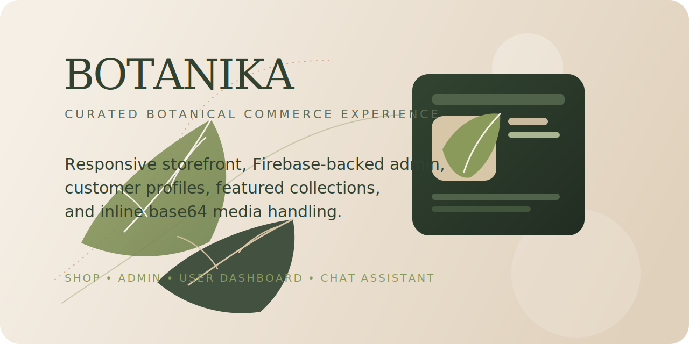

<div align="center">

<!-- Custom SVG Banner -->


<!-- Badges Row 1 -->
<p>
  <a href="https://botanika-754.netlify.app"></a>
</p>

<!-- Badges Row 2 -->
<p>
  <a href="#"></a>
  <a href="#"></a>
  <a href="#"></a>
  <a href="#"></a>
  <a href="#"></a>
</p>

<!-- Badges Row 3 -->
<p>
  <a href="#"></a>
  <a href="#"></a>
  <a href="#"></a>
  <a href="#"></a>
  <a href="#"></a>
</p>

<br/>

<!-- Original showcase SVG preserved -->


<br/>

<!-- Decorative Divider -->


<br/>

<i>A polished multi-page botanical storefront powered by Firebase — built as a college project, designed like a real product.</i>

</div>

<br/>

##  About

**Botanika** is a fully-functional botanical e-commerce storefront built with **vanilla HTML, CSS, and JavaScript**, backed by **Firebase Auth** and **Cloud Firestore** for real-time commerce flows. The project was built to remain entirely **zero-funded** — no paid services, no Firebase Storage, no server costs.

Despite being a college submission, the application features a production-grade architecture with split customer/admin surfaces, real-time data synchronization, multiple authentication methods, and a modern editorial design aesthetic.

<br/>

<div align="center">
<table>
<tr>
<td align="center" width="170">
<br/>
<b>Multi-Auth</b><br/>
<sub>Email, Google, Magic Link</sub>
</td>
<td align="center" width="170">
<br/>
<b>Real-Time Data</b><br/>
<sub>Firestore listeners</sub>
</td>
<td align="center" width="170">
<br/>
<b>Zero Framework</b><br/>
<sub>Pure vanilla JS</sub>
</td>
<td align="center" width="170">
<br/>
<b>Static Hosting</b><br/>
<sub>Netlify deploy</sub>
</td>
</tr>
</table>
</div>

<br/>

---

##  Features

<details open>
<summary></summary>
<br/>

| Feature | Description |
|---------|-------------|
| Product Catalog | Filterable product grid with category tags and featured highlights |
| Cart Drawer | Slide-out cart panel with quantity controls and real-time totals |
| Checkout Flow | Full checkout with order creation, stock decrement, and cart clearing |
| Plant Detail Pages | Rich individual product pages with care info and image galleries |
| Featured Products | Admin-controlled featured items displayed on the landing page |

</details>

<details>
<summary></summary>
<br/>

| Method | Description |
|--------|-------------|
| **Email / Password** | Traditional sign-up and login with password reset support |
| **Google Sign-In** | One-click OAuth authentication via Firebase |
| **Magic Link** | Passwordless email-link sign-in for frictionless access |
| **Session Persistence** | Auth state survives page reloads via Firebase listeners |

</details>

<details>
<summary></summary>
<br/>

| Feature | Description |
|---------|-------------|
| Product Management | Full CRUD with image upload (Base64), pricing, stock, and categories |
| User Management | View registered users, toggle admin privileges |
| Featured Control | Mark/unmark products as featured for the storefront landing |
| Order Visibility | View all customer orders with status and item breakdowns |
| Admin Auto-Seed | Default admin account auto-created on first visit |

</details>

<details>
<summary></summary>
<br/>

| Feature | Description |
|---------|-------------|
| Profile Management | Name, avatar upload (Base64), and account settings |
| Order History | Personal order timeline with status tracking |
| Cart Persistence | Cart data saved to Firestore, synced across sessions |
| Password Reset | Self-service password recovery via email |

</details>

<details>
<summary></summary>
<br/>

| Feature | Description |
|---------|-------------|
| AI Chatbot | Integrated conversational assistant for customer support |
| Comment System | Users can leave and manage comments on products |
| Contextual Help | Bot responds based on current page context |

</details>

---

##  Experience Map

```
botanika/
│
├── 🏠 index.html          ← Editorial landing page with featured products & brand storytelling
├── 🛍️ shop.html           ← Storefront with filters, search, cart drawer, and checkout
├── 🔐 auth.html           ← Sign-up, sign-in, Google auth, and magic-link entry
├── 👤 user.html            ← Profile management, order history, and settings
├── ⚙️ admin.html           ← Product CRUD, user management, and featured controls
├── 🌿 plant-detail.html   ← Individual product pages with care info
├── 📖 about.html           ← Brand story and company information
└── 🌱 care.html            ← Plant care guides and tips
```

---

##  Tech Stack

<div align="center">
<table>
<tr>
<td align="center" width="120">
<br/>
<b>HTML5</b><br/>
<sub>Structure</sub>
</td>
<td align="center" width="120">
<br/>
<b>CSS3</b><br/>
<sub>Styling</sub>
</td>
<td align="center" width="120">
<br/>
<b>JavaScript</b><br/>
<sub>Logic</sub>
</td>
<td align="center" width="120">
<br/>
<b>Firebase</b><br/>
<sub>Auth & DB</sub>
</td>
<td align="center" width="120">
<br/>
<b>Netlify</b><br/>
<sub>Hosting</sub>
</td>
</tr>
</table>
</div>

---

##  Architecture

```
├── 📂 css/                      ← Stylesheets
│   ├── styles.css               ← Global design system & shared components
│   ├── landing.css              ← Landing page styles
│   ├── shop.css                 ← Storefront & cart drawer styles
│   ├── auth.css                 ← Authentication page styles
│   ├── user.css                 ← Customer account styles
│   ├── admin.css                ← Admin dashboard styles
│   ├── plant-detail.css         ← Product detail page styles
│   ├── info.css                 ← About & care page styles
│   └── chatbot.css              ← Chatbot widget styles
│
├── 📂 js/                       ← Application Logic
│   ├── app.js                   ← Core: Firebase service, data models, CRUD, footer
│   ├── landing.js               ← Landing page interactions
│   ├── shop.js                  ← Storefront, filters, cart, checkout
│   ├── auth.js                  ← Authentication flows (email, Google, magic-link)
│   ├── user.js                  ← Profile, orders, account management
│   ├── admin.js                 ← Product CRUD, user management, featured toggle
│   ├── plant-detail.js          ← Product detail page logic
│   ├── chatbot.js               ← Chatbot integration
│   ├── firebase.config.js       ← Firebase project credentials (gitignored)
│   └── firebase.config.example.js ← Template for Firebase config
│
├── favicon.svg                  ← Site favicon
├── firestore.rules              ← Firestore security rules
├── netlify.toml                 ← Netlify deployment configuration
├── robots.txt                   ← Search engine directives
└── sitemap.xml                  ← SEO sitemap
```

---

##  Getting Started

### Prerequisites

- A modern web browser
- A **Firebase project** with Firestore and Authentication enabled
- [Netlify CLI](https://docs.netlify.com/cli/get-started/) *(optional, for deployment)*

### Local Setup

```bash
# 1. Clone the repository
git clone https://github.com/naveed-gung/botanika.git
cd botanika

# 2. Create your Firebase config
cp js/firebase.config.example.js js/firebase.config.js

# 3. Edit js/firebase.config.js with your Firebase project values

# 4. Open index.html in your browser — no build step needed!
```

### Firebase Configuration

> [!IMPORTANT]
> The file `js/firebase.config.js` is **gitignored** and will never be committed.
> You must create it locally from the provided example template.

1. Copy `js/firebase.config.example.js` → `js/firebase.config.js`
2. Paste your Firebase project values from [Firebase Console](https://console.firebase.google.com/) → Project Settings → General
3. Enable these **Auth providers** in Firebase Console → Authentication → Sign-in Method:

<div align="center">

| Provider | Required |
|:---------|:--------:|
| Email / Password | ✅ |
| Google | ✅ |
| Email Link (Passwordless) | ✅ |

</div>

4. Publish the included `firestore.rules` file to your Firestore database

---

##  Admin Setup

The application automatically seeds a default admin account on first load:

<div align="center">

| | |
|---|---|
| **Email** | `admin@botanika.com` |
| **Password** | `Botanika2026` |

</div>

> [!NOTE]
> For this account to have admin privileges on the Firestore side, you must publish the included `firestore.rules` file which grants admin access to the default admin email.

---

##  Media Limits

All media uploads are stored as **Base64 strings** directly in Firestore documents — keeping the project fully serverless without Firebase Storage.

<div align="center">

| Upload Type | Max Size |
|:------------|:--------:|
| Product Images | 1 MB |
| User Avatars | 1 MB |

</div>

---

##  Deployment

The live site is hosted on Netlify with automatic deployments:

<div align="center">

| | |
|---|---|
| **Production URL** | [botanika-754.netlify.app](https://botanika-754.netlify.app) |
| **Config** | `netlify.toml` |
| **Build** | None (static HTML/CSS/JS) |

</div>

> [!TIP]
> If you move the site to a different domain, update `robots.txt` and `sitemap.xml` to match the final URL before publishing.

---

##  Security

<div align="center">

| Layer | Protection |
|:------|:-----------|
| **Firebase Config** | `firebase.config.js` is gitignored — credentials stay local |
| **Firestore Rules** | Role-based access: public reads, user-scoped writes, admin-only management |
| **Auth Providers** | Server-side credential validation via Firebase Auth |
| **Media Validation** | Client-side 1 MB cap on all Base64 uploads |

</div>

---

##  Related Project

<div align="center">

| | Botanika Web | Botanika Desktop |
|---|:---:|:---:|
| **Type** | E-commerce storefront | Admin CRM |
| **Tech** | HTML / CSS / JS | C# WinForms |
| **Users** | Customers | Administrators |
| **Backend** | Firebase Client SDK | Firebase Admin SDK |
| **Link** | *This repository* | [botanika-desktop](https://github.com/naveed-gung/botanika-desktop) |

</div>

---

##  License

This project was developed for **educational and portfolio purposes**.

---

<div align="center">


<br/>

**Built with 🌿 by [Naveed Sohail Gung](https://github.com/naveed-gung)**

<p>
  <a href="https://www.linkedin.com/in/naveed-sohail-gung-285645310/"></a>
  <a href="https://github.com/naveed-gung"></a>
  <a href="https://naveed-gung.dev/"></a>
</p>

</div>
